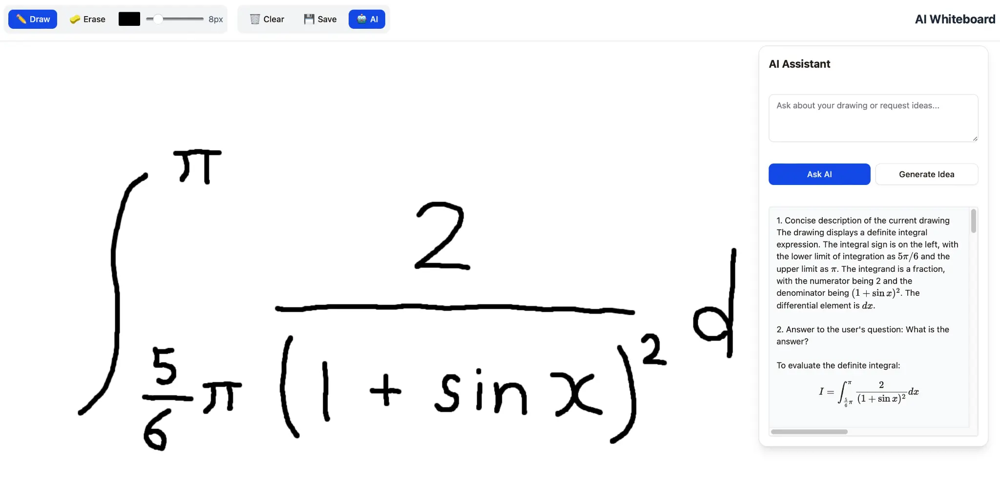

# AI Whiteboard

An intelligent online whiteboard application powered by Manus LLM API, enabling users to draw, sketch, and interact with AI-powered assistance for mathematical expressions, drawing analysis, and creative idea generation.

## Overview

AI Whiteboard is a full-stack web application that combines a canvas-based drawing interface with advanced AI capabilities. Users can draw on a digital whiteboard and receive real-time AI assistance for analyzing their drawings, answering questions about mathematical expressions, and generating creative drawing ideas.

**Key Features:**
- Interactive canvas drawing with pen and eraser tools
- Color picker and brush size adjustment
- MathJax integration for rendering mathematical expressions
- AI-powered drawing analysis and question answering
- Creative idea generation for drawings
- Real-time LaTeX formula rendering
- Responsive design for desktop and tablet use

## Application Screenshot



The screenshot above shows the AI Whiteboard interface with:
- Drawing toolbar (Draw, Erase, Color picker, Brush size, Clear, Save buttons)
- Main canvas area for drawing mathematical expressions and sketches
- AI Assistant panel on the right side displaying analysis and answers with properly rendered mathematical formulas

## Live Demo

**Production URL**: https://aiwhitebd-ufomorcg.manus.space

Access the live application directly from the link above.

## Architecture

### Technology Stack

**Frontend:**
- React 19 with TypeScript
- Tailwind CSS 4 for styling
- shadcn/ui component library
- Vite as build tool
- MathJax 3 for mathematical expression rendering
- wouter for client-side routing

**Backend:**
- Node.js with Express
- tRPC for type-safe API communication
- Manus LLM API for AI capabilities
- Drizzle ORM for database management
- MySQL/TiDB for data persistence

**Infrastructure:**
- Manus Platform for deployment and hosting
- OAuth authentication via Manus
- S3-compatible storage for file uploads

### System Architecture

```
┌─────────────────────────────────────────────────────────┐
│                    Frontend (React)                     │
│  ┌──────────────────────────────────────────────────┐  │
│  │  Canvas Drawing Interface                        │  │
│  │  - Drawing tools (pen, eraser)                   │  │
│  │  - Color and size controls                       │  │
│  │  - Save/Clear functions                          │  │
│  └──────────────────────────────────────────────────┘  │
│  ┌──────────────────────────────────────────────────┐  │
│  │  AI Assistant Panel                              │  │
│  │  - Question input                                │  │
│  │  - Ask AI / Generate Idea buttons                │  │
│  │  - Response display with MathJax rendering       │  │
│  └──────────────────────────────────────────────────┘  │
└─────────────────────────────────────────────────────────┘
                          ↓ tRPC
┌─────────────────────────────────────────────────────────┐
│                 Backend (Node.js/Express)              │
│  ┌──────────────────────────────────────────────────┐  │
│  │  tRPC Routers                                    │  │
│  │  - whiteboard.askAI: Question answering          │  │
│  │  - whiteboard.generateIdea: Idea generation      │  │
│  │  - auth: User authentication                     │  │
│  └──────────────────────────────────────────────────┘  │
│  ┌──────────────────────────────────────────────────┐  │
│  │  Manus LLM Integration                           │  │
│  │  - Image analysis for whiteboard content         │  │
│  │  - Mathematical expression evaluation            │  │
│  │  - Creative suggestion generation                │  │
│  └──────────────────────────────────────────────────┘  │
└─────────────────────────────────────────────────────────┘
                          ↓
┌─────────────────────────────────────────────────────────┐
│              Manus Platform Services                    │
│  - LLM API (Claude/GPT-based models)                    │
│  - OAuth Authentication                                │
│  - Database (MySQL/TiDB)                               │
│  - Storage (S3-compatible)                             │
└─────────────────────────────────────────────────────────┘
```

## Project Structure

```
ai-whiteboard-manus/
├── client/                          # React frontend
│   ├── src/
│   │   ├── pages/
│   │   │   ├── Home.tsx            # Main whiteboard interface
│   │   │   └── NotFound.tsx        # 404 page
│   │   ├── components/             # Reusable UI components
│   │   ├── contexts/               # React contexts
│   │   ├── hooks/                  # Custom React hooks
│   │   ├── lib/
│   │   │   └── trpc.ts            # tRPC client configuration
│   │   ├── App.tsx                 # Main app component
│   │   ├── main.tsx                # React entry point
│   │   └── index.css               # Global styles
│   ├── public/                      # Static assets
│   └── vite.config.ts             # Vite configuration
├── server/                          # Node.js backend
│   ├── _core/
│   │   ├── llm.ts                 # Manus LLM API wrapper
│   │   ├── context.ts             # tRPC context setup
│   │   ├── trpc.ts                # tRPC configuration
│   │   └── index.ts               # Server entry point
│   ├── routers.ts                 # tRPC procedure definitions
│   ├── db.ts                      # Database query helpers
│   └── storage.ts                 # S3 storage helpers
├── drizzle/
│   ├── schema.ts                  # Database schema
│   └── migrations/                # Database migrations
├── shared/                          # Shared types and constants
│   ├── const.ts                   # Application constants
│   └── types.ts                   # Shared TypeScript types
├── package.json                     # Dependencies and scripts
├── tsconfig.json                    # TypeScript configuration
├── vite.config.ts                  # Vite build configuration
└── README.md                        # This file
```

## Installation & Setup

### Prerequisites

- Node.js 18+ with pnpm
- Manus account with API access
- GitHub account for version control

### Local Development

1. **Clone the repository:**
   ```bash
   git clone https://github.com/tomoto0/ai-whiteboard-manus.git
   cd ai-whiteboard-manus
   ```

2. **Install dependencies:**
   ```bash
   pnpm install
   ```

3. **Configure environment variables:**
   ```bash
   cp .env.example .env
   ```
   
   Update `.env` with your Manus credentials:
   ```
   DATABASE_URL=your_database_url
   JWT_SECRET=your_jwt_secret
   VITE_APP_ID=your_manus_app_id
   OAUTH_SERVER_URL=https://api.manus.im
   VITE_OAUTH_PORTAL_URL=https://portal.manus.im
   BUILT_IN_FORGE_API_URL=https://api.manus.im
   BUILT_IN_FORGE_API_KEY=your_api_key
   ```

4. **Run database migrations:**
   ```bash
   pnpm db:push
   ```

5. **Start the development server:**
   ```bash
   pnpm dev
   ```

   The application will be available at `http://localhost:3000`

## Deployment

### Deploy to Manus Platform

The application is configured for deployment on the Manus Platform using the built-in deployment tools.

#### Deployment Steps:

1. **Prepare the project:**
   ```bash
   # Ensure all changes are committed
   git add -A
   git commit -m "Prepare for deployment"
   ```

2. **Create a checkpoint (via Manus UI):**
   - Navigate to the project dashboard
   - Review the changes
   - Create a checkpoint to capture the current state

3. **Deploy via Manus UI:**
   - Click the "Publish" button in the Management UI
   - Follow the deployment prompts
   - Wait for the deployment to complete

4. **Access the deployed application:**
   - Production URL: `https://aiwhitebd-ufomorcg.manus.space`
   - The application will be available immediately after deployment

#### Environment Configuration:

The following environment variables are automatically injected by the Manus Platform:
- `BUILT_IN_FORGE_API_KEY` - API key for Manus services
- `BUILT_IN_FORGE_API_URL` - Manus API endpoint
- `JWT_SECRET` - Session signing secret
- `OAUTH_SERVER_URL` - OAuth provider URL
- `OWNER_NAME` - Application owner name
- `OWNER_OPEN_ID` - Owner's OpenID
- `VITE_ANALYTICS_ENDPOINT` - Analytics endpoint
- `VITE_ANALYTICS_WEBSITE_ID` - Analytics website ID
- `VITE_APP_ID` - Manus application ID
- `VITE_APP_LOGO` - Application logo URL
- `VITE_APP_TITLE` - Application title
- `VITE_OAUTH_PORTAL_URL` - OAuth portal URL

## Usage

### Drawing Interface

1. **Select a tool:** Click "Draw" or "Erase" button to select the tool
2. **Choose color:** Click the color picker to select a pen color
3. **Adjust brush size:** Use the slider to adjust brush size (1-50px)
4. **Draw:** Click and drag on the canvas to draw
5. **Clear:** Click "Clear" to erase all drawings
6. **Save:** Click "Save" to download the drawing as PNG

### AI Assistant

1. **Open AI Panel:** Click the "AI" button to open the AI Assistant panel
2. **Ask a question:** Type your question in the text area
3. **Get analysis:** Click "Ask AI" to get AI analysis of your drawing and answer to your question
4. **Generate ideas:** Click "Generate Idea" to get creative suggestions for your drawing
5. **View results:** AI responses are displayed with properly rendered mathematical formulas

### Mathematical Expression Support

The application supports LaTeX mathematical expressions:
- **Inline formulas:** `$formula$` (e.g., `$f(x) = x^2$`)
- **Display formulas:** `$$formula$$` (e.g., `$$\int_0^{\pi} \sin(x) dx = 2$$`)

MathJax automatically renders these expressions in the AI response panel.

## API Endpoints

### tRPC Procedures

**Whiteboard Router:**

- `whiteboard.askAI`
  - Input: `{ question: string, imageData?: string }`
  - Output: `{ answer: string }`
  - Description: Analyzes the whiteboard drawing and answers user questions

- `whiteboard.generateIdea`
  - Input: `{ imageData?: string }`
  - Output: `{ idea: string }`
  - Description: Generates creative ideas for drawing development

**Auth Router:**

- `auth.me`
  - Output: Current user object or null
  - Description: Gets current authenticated user

- `auth.logout`
  - Output: `{ success: boolean }`
  - Description: Logs out the current user

## Development

### Project Commands

```bash
# Start development server
pnpm dev

# Build for production
pnpm build

# Run tests
pnpm test

# Type check
pnpm type-check

# Format code
pnpm format

# Lint code
pnpm lint

# Database operations
pnpm db:push      # Push schema changes
pnpm db:generate  # Generate migrations
pnpm db:migrate   # Run migrations
```

### Code Structure Guidelines

**Frontend:**
- Use shadcn/ui components for consistent UI
- Leverage Tailwind CSS for styling
- Call tRPC procedures via `trpc.*.useQuery/useMutation` hooks
- Implement proper loading and error states

**Backend:**
- Define database tables in `drizzle/schema.ts`
- Create query helpers in `server/db.ts`
- Add tRPC procedures in `server/routers.ts`
- Use `invokeLLM` helper for AI interactions

## Key Features Implementation

### MathJax Integration

Mathematical expressions in AI responses are rendered using MathJax 3:
- CDN-based loading for reliability
- Automatic rendering of LaTeX expressions
- Support for both inline and display formulas
- State preservation during UI interactions

### Manus LLM Integration

The application uses Manus LLM API for:
- **Image Analysis:** Understanding whiteboard drawings
- **Question Answering:** Providing detailed responses about mathematical content
- **Idea Generation:** Creating suggestions for drawing development

### Canvas Drawing

- HTML5 Canvas API for drawing
- Touch support for tablet devices
- Multiple drawing tools (pen, eraser)
- Customizable brush properties

## Troubleshooting

### Common Issues

**Issue: MathJax formulas not rendering**
- Solution: Ensure MathJax CDN is accessible and check browser console for errors
- The application uses `https://cdn.jsdelivr.net/npm/mathjax@3/es5/tex-mml-chtml.js`

**Issue: AI responses are slow**
- Solution: This is normal for the first request. Subsequent requests should be faster.
- Check your internet connection and Manus API status

**Issue: Canvas drawing is laggy**
- Solution: Try reducing the brush size or closing other applications
- The canvas uses requestAnimationFrame for smooth performance

## Security Considerations

- All API calls go through the Manus-authenticated backend
- User authentication is handled by Manus OAuth
- Database queries use parameterized statements via Drizzle ORM
- Environment variables are securely managed by Manus Platform
- No sensitive data is stored in browser localStorage

## Performance Optimization

- React 19 with automatic batching
- Tailwind CSS for minimal CSS bundle size
- Lazy loading of components
- Efficient canvas rendering with requestAnimationFrame
- CDN-based MathJax loading
- Optimized database queries with Drizzle ORM

## Browser Support

- Chrome/Edge 90+
- Firefox 88+
- Safari 14+
- Mobile browsers (iOS Safari, Chrome Mobile)

## Contributing

This is a private repository. For contributions, please:
1. Create a feature branch
2. Make your changes
3. Test thoroughly
4. Submit a pull request

## License

This project is proprietary and maintained by tomoto0.

## Support & Contact

For issues, questions, or feature requests, please contact the development team through the GitHub Issues page.

## Version History

- **v1.0.0** (November 20, 2024) - Initial release with Manus LLM integration
  - Canvas drawing interface
  - AI-powered analysis and idea generation
  - MathJax formula rendering
  - Manus OAuth authentication

## Technical Notes

### Database Schema

The application uses Drizzle ORM with the following core table:
- `users` - User authentication and profile data

Additional tables can be added as needed following the Drizzle schema pattern.

### State Management

- React hooks for component state
- tRPC query cache for server state
- Context API for global state (theme, auth)

### API Communication

- tRPC for type-safe RPC calls
- Automatic request/response validation
- Built-in error handling and retry logic

## Future Enhancements

Potential features for future versions:
- Drawing history and undo/redo functionality
- Collaborative whiteboard support
- Advanced shape recognition
- Drawing export in multiple formats
- Real-time collaboration with multiple users
- Custom AI model selection
- Drawing templates and examples
- Voice input for questions

---

**Last Updated:** November 20, 2024
**Repository:** https://github.com/tomoto0/ai-whiteboard-manus
**Deployed At:** https://aiwhitebd-ufomorcg.manus.space
